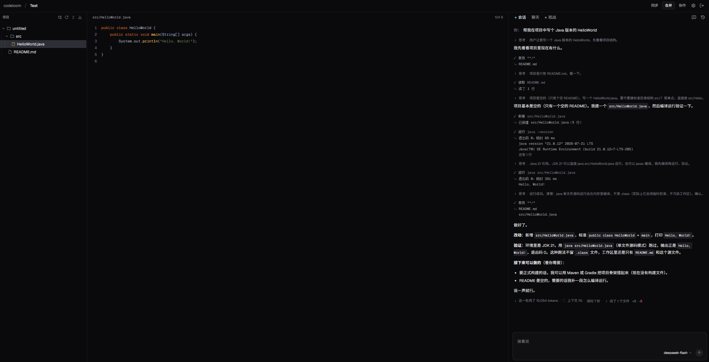

<h1 align="center">codeloom</h1>

<h3 align="center">两个人，各自带一个 AI agent，在同一个仓库里写代码</h3>

<p align="center"><strong>
  <a href="#快速开始">快速开始</a> ·
  <a href="#功能">功能</a> ·
  <a href="#技术栈">技术栈</a> ·
  <a href="docs/decisions/">决策记录</a>
</strong></p>



codeloom 是一个**两个人共用的 AI 编码工作台**：你和另一个人各带一个 AI agent，在同一个 git 仓库里干活。
每个人有自己的一棵工作树和一个 agent，对方在改什么、agent 走到哪一步，实时看得见；
两个人可以同时开工、不用等对方跑完；改动什么时候合进主干，由人决定。

> [!WARNING]
> agent 执行的命令**没有沙箱** —— 每条命令都直接跑在你这台机器上（写文件、装依赖、跑构建脚本）。别让它去跑你不信任的仓库。

## 快速开始

需要 **JDK 21**、**Node 22.12+**、**Docker** —— MySQL 8 和 Redis 7 由仓库里的 compose 起。

```sh
# 1. 克隆，然后起中间件（MySQL 3306 + Redis 6379，口令都是 root）
git clone https://github.com/mikumikuneko/codeloom.git && cd codeloom
cd docs/deploy/middleware && docker compose up -d && cd ../..

#    等 `docker compose ps` 里两个都 healthy 再往下 —— MySQL 第一次启动要初始化数据目录，会慢一些

# 2. 建表，再写本地配置（那个文件已被 gitignore，不进版本库）
docker exec -i mysql mysql -uroot -proot < docs/sql/schema.sql
cp codeloom-app/src/main/resources/application-local.yml.example \
   codeloom-app/src/main/resources/application-local.yml
#    打开它，把 secret-key 换成一串自己生成的随机值：openssl rand -base64 32
#    它没有默认值也不会自动生成 —— 每次重启换一把的话，库里已经加密的 API Key 就再也解不开了

# 3. 起后端：先把依赖模块装进本地仓库，再单独跑 app
mvn -DskipTests install
mvn -pl :codeloom-app spring-boot:run          # http://localhost:8080

# 4. 另开一个终端，起前端
cd frontend && npm install && npm run dev      # http://localhost:5173
```

打开 http://localhost:5173，然后：

1. 用**两个浏览器**、或者一个正常窗加一个隐身窗（同一个浏览器里只放得下一个登录态），两边各注册**一个账号**（一个项目最多两个人）
2. 在「供应商」页各配一把自己的 API Key
3. 建一个项目
4. 说第一句话

> [!NOTE]
> 界面上现在只支持 **DeepSeek** 一个预设。

## 功能

- **两个人的改动互相看得见** —— 各自一棵 git 工作树，随时能看对方那棵树上改了什么；对方新建了文件，你的 agent 下一轮开头会收到一句提醒
- **你的工作树只有你能改** —— 对方看得见、写不进去
- **每一步都能回放** —— 对话、工具调用、审批、检查点都是事件；断线能补齐，事后能审计，进程崩了也知道上次停在哪（**不自动重跑**）
- **同一棵工作树上同一时刻只有一个执行者** —— 锁过期之后醒来的那个写入者，会被写入之前的一道校验拒掉，不靠它自觉
- **退回去就是退整棵树** —— 说「回到第三句之前」，代码和对话一起退到那儿
- **命令要么直接跑，要么先问你** —— 批准只放行那一条命令，不是「这类以后都别问」
- **上下文会自己腾地方** —— 快满了就压缩，压缩本身也是一条事件，所以历史仍然完整

## 技术栈

- **前端**：React 19 · TypeScript · Vite 8 · Tailwind CSS 4 · Radix UI · Zustand
- **后端**：Java 21 · Spring Boot 3.5 · Spring Security · MyBatis
- **数据**：MySQL 8（只追加的事件表）· Redis 7（执行租约、会话、实时推送）
- **实时**：SSE（断线靠 `Last-Event-ID` 补齐）+ WebSocket（项目内聊天）
- **模块**：`domain` · `workspace` · `agent` · `realtime` · `app`，依赖只能由外向内，`domain` 零依赖

## 文档

- [决策记录](docs/decisions/) —— 每个技术决策的理由、被否决的方案和代价
- [表结构](docs/sql/schema.sql)
- [中间件部署](docs/deploy/middleware/) —— MySQL 8 + Redis 7 的 compose 和三条关键配置

## 许可证

[MIT](LICENSE)
